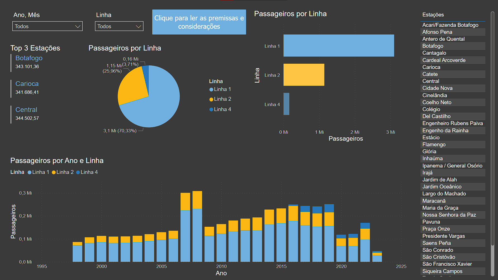

# Relatório do Sistema de Transporte Público

Este relatório contém quatro páginas: Overview, Visão por Linhas, Visão por Estações e Extração de Dados.

## Overview

A página mostra os principais indicadores de desempenho do sistema de transporte público, como o número total de passageiros, a receita bruta, a taxa de ocupação e o índice de satisfação dos usuários. Também mostra a evolução desses indicadores ao longo dos anos e a comparação com outras estações.

## Visão por Linhas

A página mostra o detalhamento dos indicadores por linha do sistema de transporte público, como o número de passageiros. Também mostra a distribuição dos passageiros por linha.

## Visão por Estações

A paágina mostra o detalhamento dos indicadores por estação do sistema de transporte público.

## Extração de Dados

A página de extração de dados permite exportar os dados do relatório em formato CSV ou Excel, com a possibilidade de filtrar os dados por ano, mês, linha ou estação.

## Análises Adicionais

Além dos indicadores apresentados nas páginas anteriores, eu também fiz algumas análises adicionais sobre os dados, tais como:

1. A média de passageiros por estação, usando a função `groupby` do pandas e o método `mean`.
2. O desvio padrão de passageiros por mês, usando a função `groupby` do pandas e o método `std`.
3. O crescimento percentual de passageiros por estação entre o primeiro e o último mês do conjunto de dados, usando a função `groupby` do pandas e o método `pct_change`.
4. A correlação entre o número de passageiros e o mês do ano para cada estação, usando a função `groupby` do pandas e o método `corr`.
5. O coeficiente de determinação (R2) da regressão linear entre o número de passageiros e o mês do ano para cada estação, usando a função `linregress` do scipy.stats.

No entanto, essas análises foram inconclusivas, pois não mostraram nenhuma relação significativa ou padrão claro entre as variáveis analisadas. Portanto, elas não foram incluídas no relatório principal.
